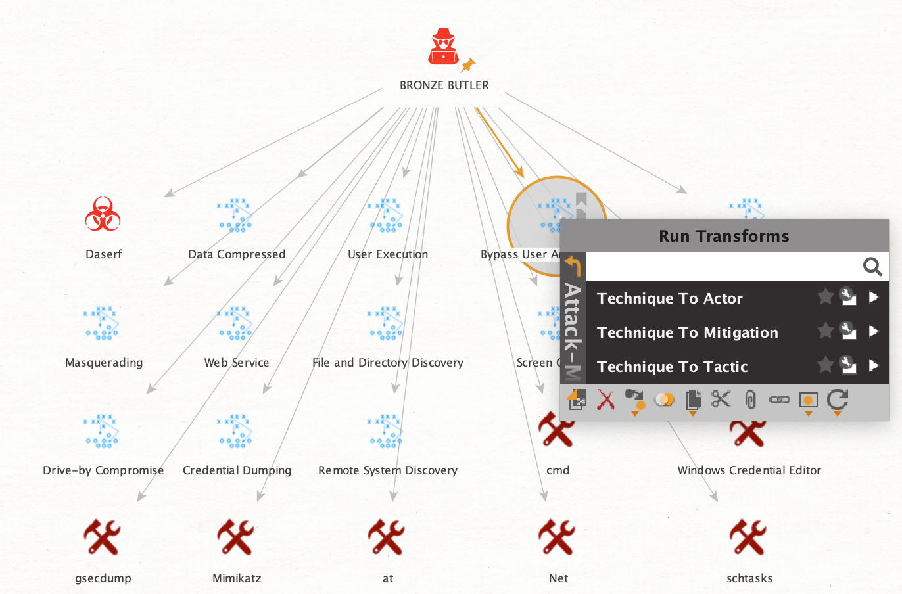

# attack-maltego

This is a Maltego Local Transforms for explore the MITRE ATT&CK dataset. 

<<<<<<< HEAD
# ScreenShots

=======
>>>>>>> origin/master
### Requirements

- Python 3.5 or later (May be run Python 2.7)
- Canari Framework(https://canari3.readthedocs.io/en/latest/)
- pyattck(https://github.com/swimlane/pyattck)

### Installation

Thease instruction have been tested on Ubuntu 18.04.2.

1. Download and install Maltego
2. Install using by pip: `sudo pip install git+https://github.com/tadmaddad/attack-maltego.git`
3. Changing the working directory to package location.
4. Generate to Maltego configuration file. `canari create-profile attack-maltego`
5. Import the configuration file to Maltego.
    1. Open Maltego
    2. Click on the home button (Maltego icon, top-left corner).
    3. Click on 'Import'
    4. Click on 'Import Configuration'.
    5. Load the attack-maltego.mtz file and follow the prompts.

### Third Party

- This software is using pyattck that third-party libraly. licensed under MIT - Swimlane
- This software is using Canari that Maltego Framework. licensed under GPLv3 - Nadeem Douba
- The Entity icons are from intelligence-icons licensed CC-BY-SA - Françoise Penninckx, Brett Jordan

### License

- This software is licensed under GNU General Public License version 3
